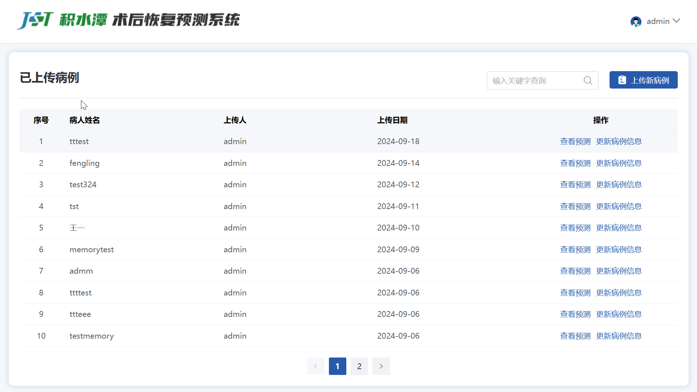
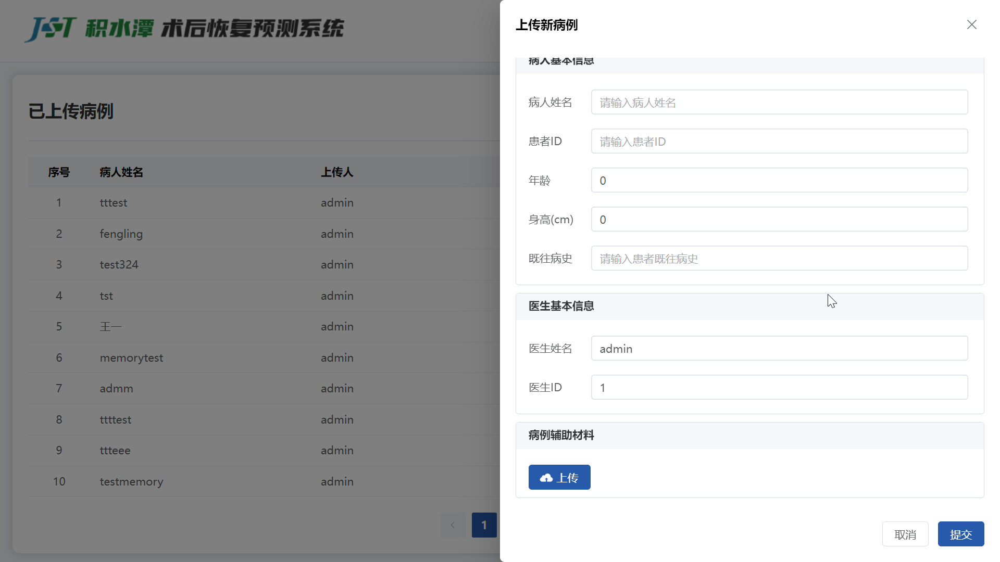
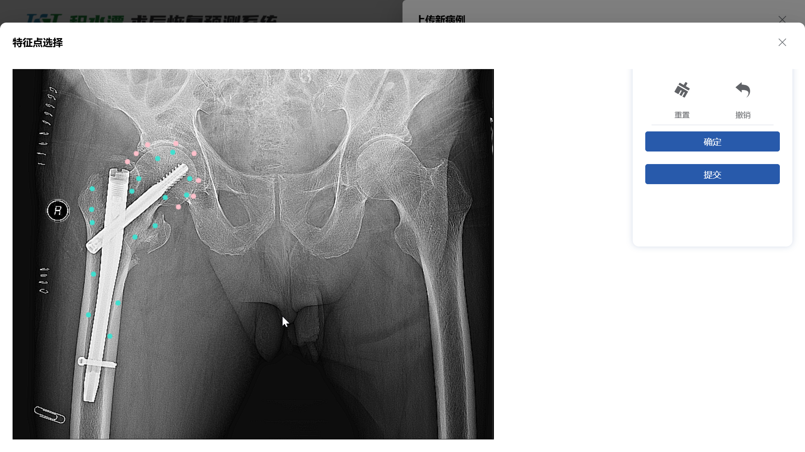
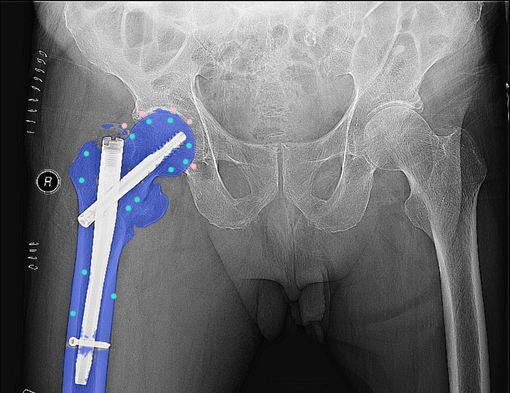
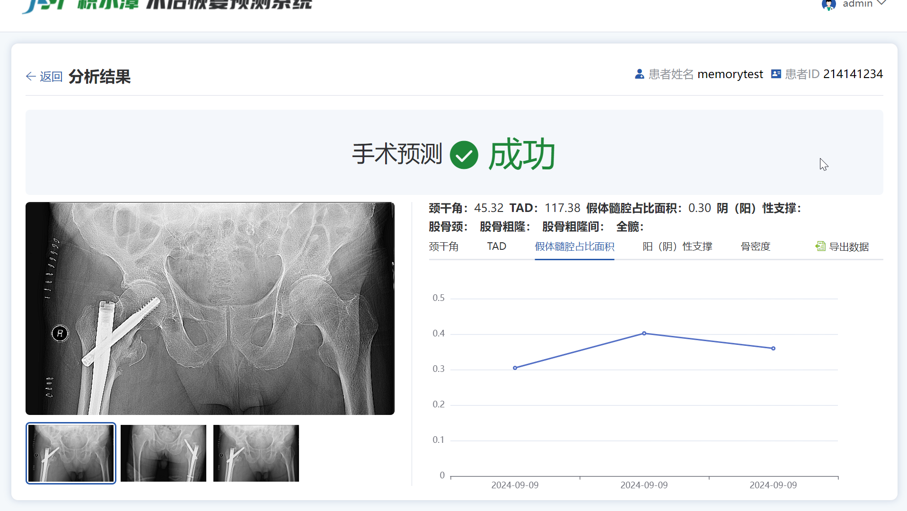

## 启动项目

### 下载依赖

```sh
npm install
```

### 本地启动

```sh
npm run dev
```

### 打包上线

```sh
npm run build
```

## 项目简介

### 首页




- 点击上传新病例，填写信息并点击上传按钮上传病例文件（现在为图片文件）进入特征点选择界面
- 点击查看预测查看这个病人的所有预测
- 点击更新病例信息为病人添加新的病例文件

### 特征点选择界面



- 点击确定按钮表示用现在选取的特征点去**分割图片**
- 点击提交按钮表示确认用现在的图片分割结果去**计算数据并预测手术成功率**
- 点击左键添加蓝色特征点，表示添加这部分区域
- 点击右键添加红色特征点，表示去除这部分区域
- 点击重置按钮清除所有特征点
- 点击撤销按钮撤销上一次的操作

### 图片分割结果



### 分析结果页面



- 切换图片可以看到这次预测的全部数据
- 在图表中可以看到每个具体数据的随时间的变化折线图
- 点击导出数据导出病例全部数据为xlsx文件
